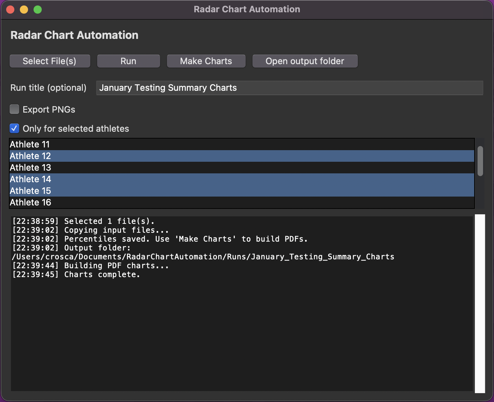
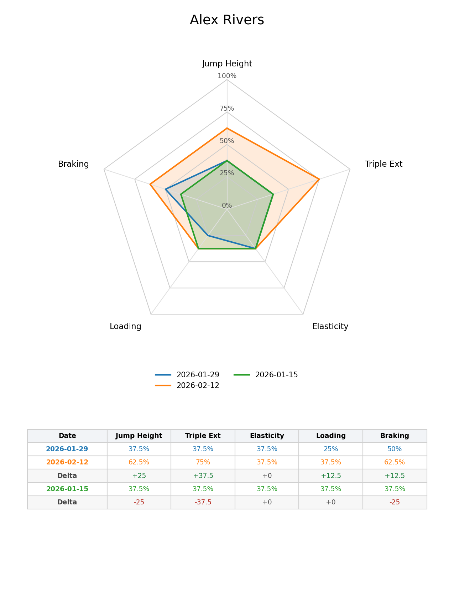

# Radar Chart Automation

A cross-platform desktop app that turns Teamworks AMS CMJ exports into athlete radar charts, percentile tables, and print-ready reports.

## Download
Download the latest macOS or Windows build from the GitHub Releases page.

## Screenshots



## Quick start (end users)
1. Open the app (.app on macOS or .exe on Windows).
2. Click **Select CSV(s)** and choose one or more Teamworks exports (one date per CSV).
3. (Optional) Enter a **Run title**.
4. (Optional) check **Export PNGs**.
5. Click **Run**.
6. Click **Open output folder** and print the PDF.

## Inputs
- One CSV per test date (Teamworks AMS export).
- Athlete name column is auto-detected; if missing, you will be prompted to map columns.
- Required metrics (numeric columns):
  - Jump Height (in) → Jump Height
  - Peak Power/BM → Triple Ext
  - RSI-Modified → Elasticity
  - Eccentric Peak Power/BM → Loading
  - Eccentric Deceleration RFD/BM → Braking

## Outputs
- Output path: `~/Documents/RadarChartAutomation/Runs/<run_folder_name>/`
- Each run creates:
  - `01_raw_input/` (copied CSVs)
  - `02_percentiles/` (long + wide percentile CSVs)
  - `03_outputs/` (multi-page PDF + optional PNGs)
  - `logs/` (run log)
- Multi-page PDF is Letter (8.5x11) and print-ready.

## Troubleshooting
- **Missing columns**: you’ll be prompted to map them.
- **Non-numeric values**: the run will stop and report the offending column.
- **Tkinter errors on macOS**: use a Tk-enabled Python build (pyenv with framework or python.org installer).

## Privacy
All processing is local. No uploads. Do not commit CSVs or output folders to git.

## Maintainer
### Local run
```
cd radar_chart_automation
python -m venv .venv
source .venv/bin/activate  # macOS/Linux
.venv\Scripts\activate     # Windows
pip install -r requirements.txt
python app.py
```

### Build (macOS)
```
cd radar_chart_automation
pyinstaller --noconfirm radar_chart_automation.spec
```
Output: `dist/RadarChartAutomation.app`

### Build (Windows)
```
cd radar_chart_automation
pyinstaller --noconfirm radar_chart_automation.spec
```
Output: `dist/RadarChartAutomation/RadarChartAutomation.exe`

### Release (tag + publish builds)
```
python radar_chart_automation/scripts/release.py --patch
```
This bumps the version, tags `vX.Y.Z`, pushes the tag, and triggers GitHub Actions to attach macOS/Windows zips to the Release.
